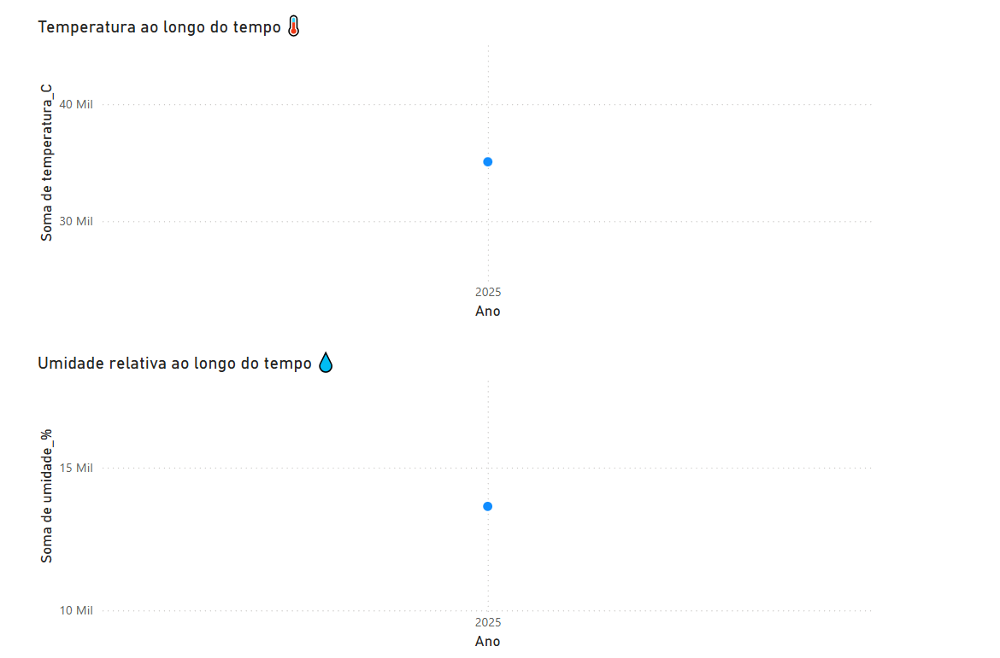

# 🌤️ Coleta de Dados Climáticos com API Aberta

Este projeto realiza a coleta de dados climáticos (temperatura e umidade) de uma localidade específica utilizando a [API Open-Meteo](https://open-meteo.com/), com salvamento em um arquivo CSV para análise posterior.

## 🎯 Objetivo da Coleta de Dados Climáticos

O objetivo da coleta automática de dados climáticos (temperatura e umidade) é criar uma base estruturada e atualizada para:

- Monitorar variações climáticas ao longo do tempo
- Auxiliar em análises preditivas e estudos ambientais
- Servir como fonte para dashboards e visualizações interativas
- Praticar conceitos aprendidos na pós-graduação em Ciência de Dados, como consumo de APIs, tratamento de dados e visualização com Power BI

## 🛠️ Tecnologias Utilizadas

- Python
- Bibliotecas: `requests`, `pandas`, `os`
- API: Open-Meteo (gratuita e sem autenticação)

## 🗂️ Estrutura do Projeto
📁 Projeto Clima
├── 📁 data
│   └── dados_climaticos.csv
├── 📁 scripts
│   └── coleta_clima.py
├── dashboard_climatico.png
└── README.md


## 🚀 Como Executar

1. Clone este repositório:
   ```bash
 git clone https://github.com/fabioalves97/projeto-temperatura.git

2. Crie e ative um ambviente virtual:
python -m venv venv
venv\Scripts\activate  # No Windows
source venv/bin/activate  # No Linux/macOS

3. Instale as dependências:
pip install requests pandas

4. Execute o script:
python scripts/coleta_clima.py

📊 Exemplo de saída (DataFrame)

| data_hora           | temperatura_C | umidade_% |
|---------------------|---------------|-----------|
| 2025-04-12T00:00    | 18.5          | 93        |
| 2025-04-12T01:00    | 18.3          | 94        |
| 2025-04-12T02:00    | 18.2          | 94        |
| 2025-04-12T03:00    | 17.9          | 96        |
| 2025-04-12T04:00    | 17.5          | 97        |

## 📊 Dashboard

<p align="center">
  
</p>

## ✨ Próximos Passos
- Agendar coletas automáticas (via Agendador de Tarefas do Windows)

- Criar dashboard com Streamlit (como alternativa ao Power BI)

- Integrar armazenamento em nuvem (AWS S3, GCP, Azure Blob)

- Realizar análises exploratórias e modelos preditivos

---
📌 Autor

Fábio A. Oliveira

Projeto desenvolvido para praticar os conhecimentos adquiridos na pós-graduação em Ciência de Dados, juntamente com estudos e pesquisas pessoais sobre o tema.


